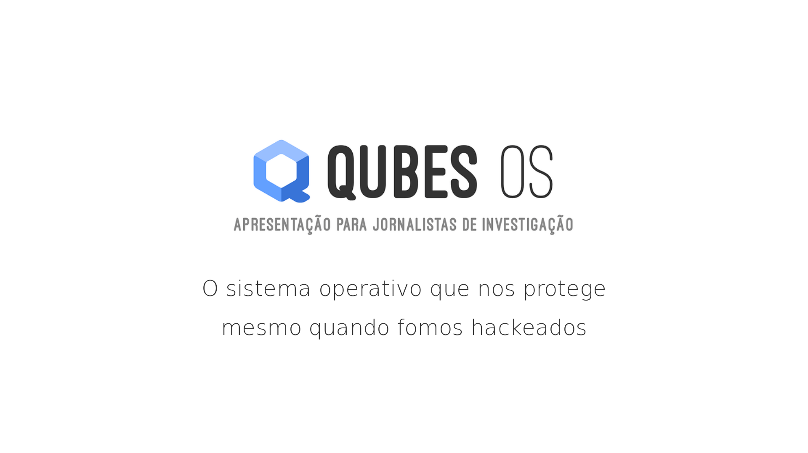

# QubesOS

-----

A gentle introduction to QubesOS for investigative Journalists (in Portuguese)

----

The [**slides.md**](./slides.md) MarkDown is written for reveal.js, a tool that displays presentations as a webpage, To view the presentation open the file `index.html` in the web browser.

License [CC BY-SA 4.0](http://creativecommons.org/licenses/by-sa/4.0/)

Apresentação
-------------------

A apresentação tem como público alvo joranlistas de investigação. E como objetivo a promoção da segurança informática na atividade jornalística.

Feito no contexto do grupo [privacyLx](privacylx.org).