<!-- .slide: data-state="no-toc-progress" -->
<!-- don't show toc progress bar on this slide -->

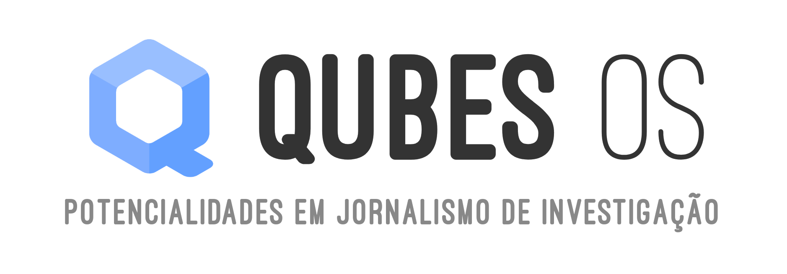

note:
- agradecer a presença
- vamos apresentar um sistema operativo

---

<!-- .slide: data-background-image="images/opened-boxes-header.png" -->

# Aviso ⚠️

1. O conhecimento que aqui passamos não subsitui treino por profissionais

2. É importante ter a noção que nada é 100% seguro

note:
o objetivo é apenas dar a conhecer o que existe
o conhecimento que aqui passamos não é suficiente para o uso em segurança

---

# ✋ perguntas
Quando quiserem

--- ---

# Contexto

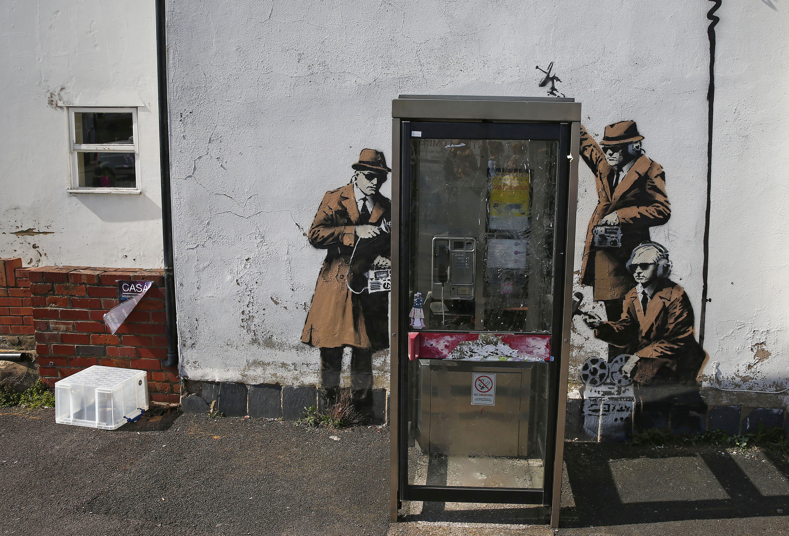

note:
Em que contexto se insere esta apresentação?

Na era digital, a segurança dos jornalistas torna-se bastante diferente

---

# No passado

Jornalistas podiam proteger as suas fontes simplesmente não as revelando quando interrogados.

---

# Já não se aplica

Tudo deixa um rasto digital!

note:
alguns exemplos são:
* chamadas telefónicas
* documentos apagados
* emails

---

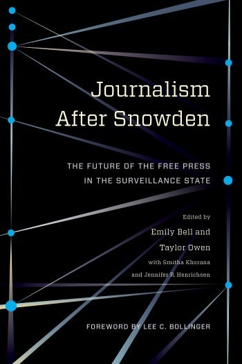</img>

# Vigilância Moderna
  

- massificada
- barata
- ubíqua

--- ---

# Segurança
em Jornalismo

note:
segurança é algo contextual. Depende sempre do que se está a investigar e de quem poderá estar interessado em evitar essa publicação

---

# OPSEC

Segurança Operacional

---

# Assets

O que queremos proteger

---

- **Fontes Jornalísticas**
<!-- .element: class="fragment" -->
- documentos de investigações atuais
<!-- .element: class="fragment" -->
- e passadas
<!-- .element: class="fragment" -->

  

- comunicações sensíveis
<!-- .element: class="fragment" -->
- contas online
<!-- .element: class="fragment" --
>
--- ---

# O problema

---

</img>
</img>
  

 Desenhados para serem convenientes
 <!-- .element: class="fragment" -->  
  
**não para serem seguros**
 <!-- .element: class="fragment" --> 

---

#### Fazemos tudo no mesmo sistema <!-- .element: class="fragment" --> 

documentos, emails, fotografias, etc.
<!-- .element: class="fragment" --> 

---

Quais os 
# Riscos que corremos?

---

# phishing
Emails mailiciosos

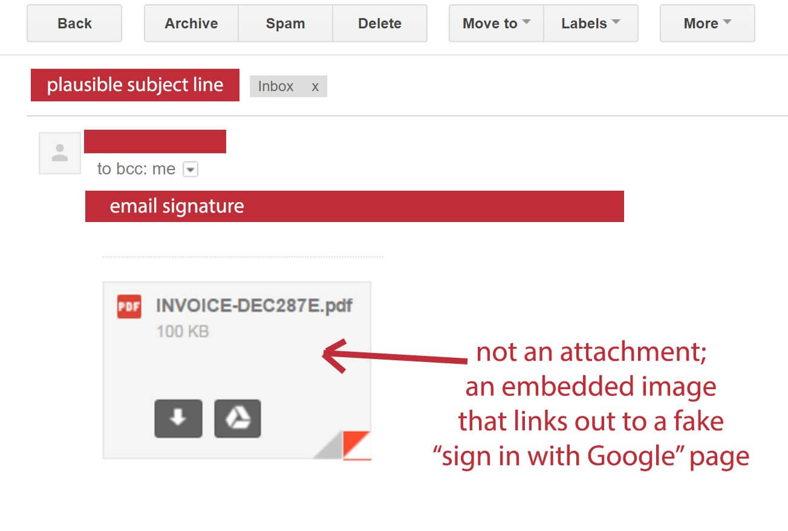
<!-- image source: https://www.googlewatchblog.de/2017/01/angriff-gmail-nutzer-neue/ -->

note:
Phishing é de longe o meio mais comum de ataque. Consiste no envio de emails mailiosos na esperaça que o destinatário
clique num link ou que abra um ficheiro em anexo. Independentemente da quantidade de treino que uma organização faça,
há sempre pelo menos 25% das pessoas que caem na armadilha.

---

# Ficheiros desconhecidos

📄
👾

---

# Navegar na net

note:
Certos sites, por vezes até de fontes fidedignas, podem estar infetadas com conteúdo malicioso e que,
sem que o utilizador suspeite, instalam malware no computador. Isso permite aos atacantes essencialmente
fazer o que quiserem com ele: vasculhar documentos, ligar a webcam e tirar fotografias, etc.

---

# Portas de Entrada

- navegar na net
<!-- .element: class="fragment" --> 
- abrir documentos desconhecidos
<!-- .element: class="fragment" --> 
- phishing 
<!-- .element: class="fragment" --> 
- roubo físico 
<!-- .element: class="fragment" --> 
- sistema operativo
<!-- .element: class="fragment" --> 

--- ---

</img>
# Qubes OS
como solução

---

alternativa ao
# Windows
  

mas também corre programas do windows

(mais à frente)

---

# software livre

---

# Recomendado
 

"If you're serious about security, Qubes OS is the best
OS available today. It's what I use, and free."

<cite>Edward Snowden </cite>

---

# Único 
em termos de segurança

---

Segurança por
### Compartimentalização

💻  <!-- .element: class="fragment" --> 
💻  <!-- .element: class="fragment" --> 
💻  <!-- .element: class="fragment" --> 

---

# Domínios de Segurança

Tudo corre em máquinas virtuais

note:
**DEMO:** abrir dois qubes e mostrar os seus gestores de ficheiros
para demostrar como estes mostra ficheiros diferentes de facto.
  - chamar para a atençao o facto de cada qube ter a sua cor

---

organizado por
# cores
🗃

📕 inseguro  &nbsp; 📗 investigação  &nbsp; 📘 vault

---

# 📕 inseguro

Para navegar na net por qualquer site

---

# 📗 investigação

Contem todos os documentos de uma investigação,emails, etc.

---

# 📘 vault

Onde armazenamos palavras-passe e outras credenciais

---

# Demo

Vamos ver isto em ação

note:
mostrar aqui os vários tipos de máquinas em paralelo e chamar à atenção as cores.
Mostrar também a funcionalidade de ter uma máquina offline com as credenciais

--- ---

# Isolamento

Cada máquina virtual (qube) 

está isolada das outras

---

### 📁 Copiar ficheiros

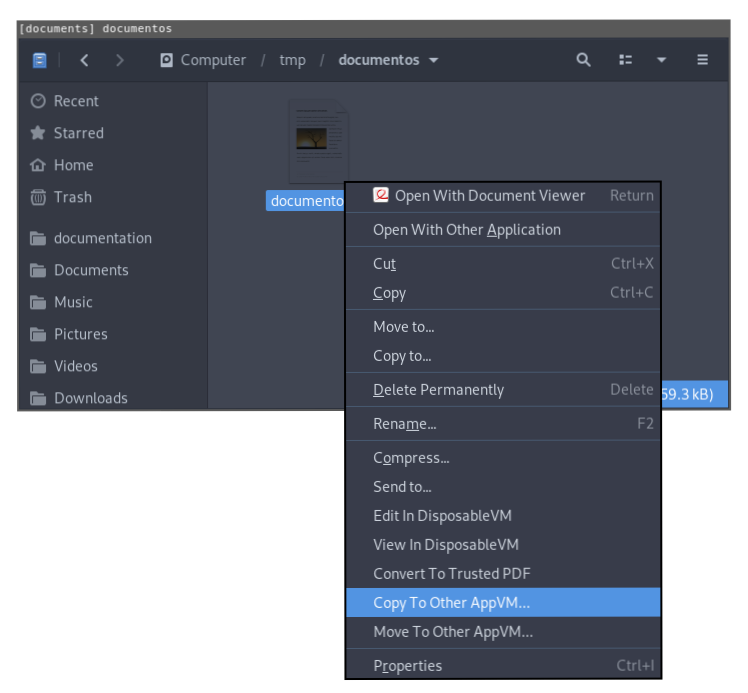

---

# 📋 Clipboard

copiar `ctrl-c`

copiar partilhado: `ctrl-shift-c`
<!-- .element: class="fragment" --> 

colar partilhado: `ctrl-shift-v`
<!-- .element: class="fragment" --> 

colar `ctrl-v`

--- ---

# Proteção USB

Temos controlo sobre que máquinas têm acesso a que dispositivos

---

# 📸 Webcam

Nada tem acesso

sem o darmos explicitamente

---

# 🎙Microfone

idem.

--- ---

# Amnésia
 

É o que nos permite estar seguros
<!-- .element: class="fragment" --> 
mesmo que tenhamos sido hackeados
<!-- .element: class="fragment" --> 

---

# Como ?

---

Sistema apenas guarda documentos
<!-- .element: class="fragment" --> 

Usa uma cópia fresca assim que reiniciamos
<!-- .element: class="fragment" --> 

---

# Instalar programas

tem que ser feito numa máquina **template**

---

# 🗑 Máquinas Descartávies

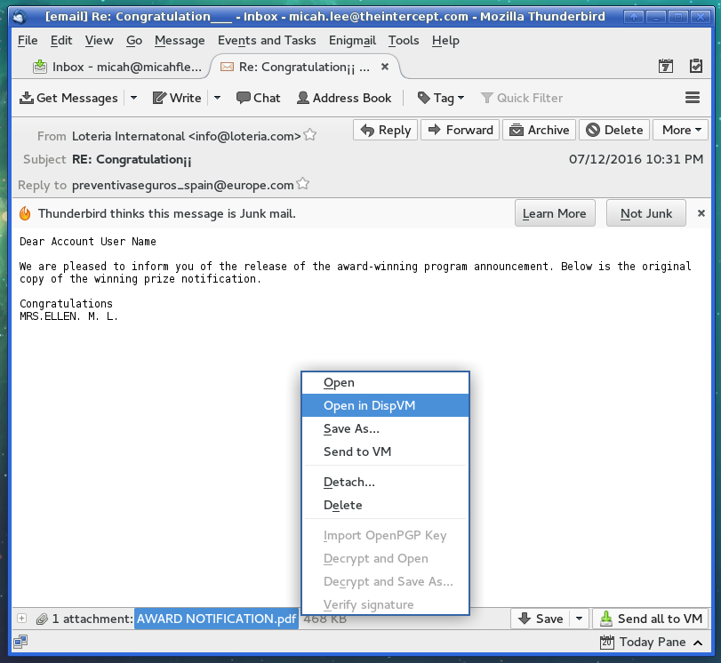

---

📄 

# Ver documentos 
em Segurança

---

📄 

# Editar documentos 
em Segurança

---

# Windows

Também é possível correr programas do windows

---

<!-- .slide: data-background-image="images/windows-qubes.png" -->

--- ---

# 🔐 Disco Encriptado
  

Só é possível ler os conteúdos armazenados
no computador com uma frase-chave

---

por comparação
# em windows

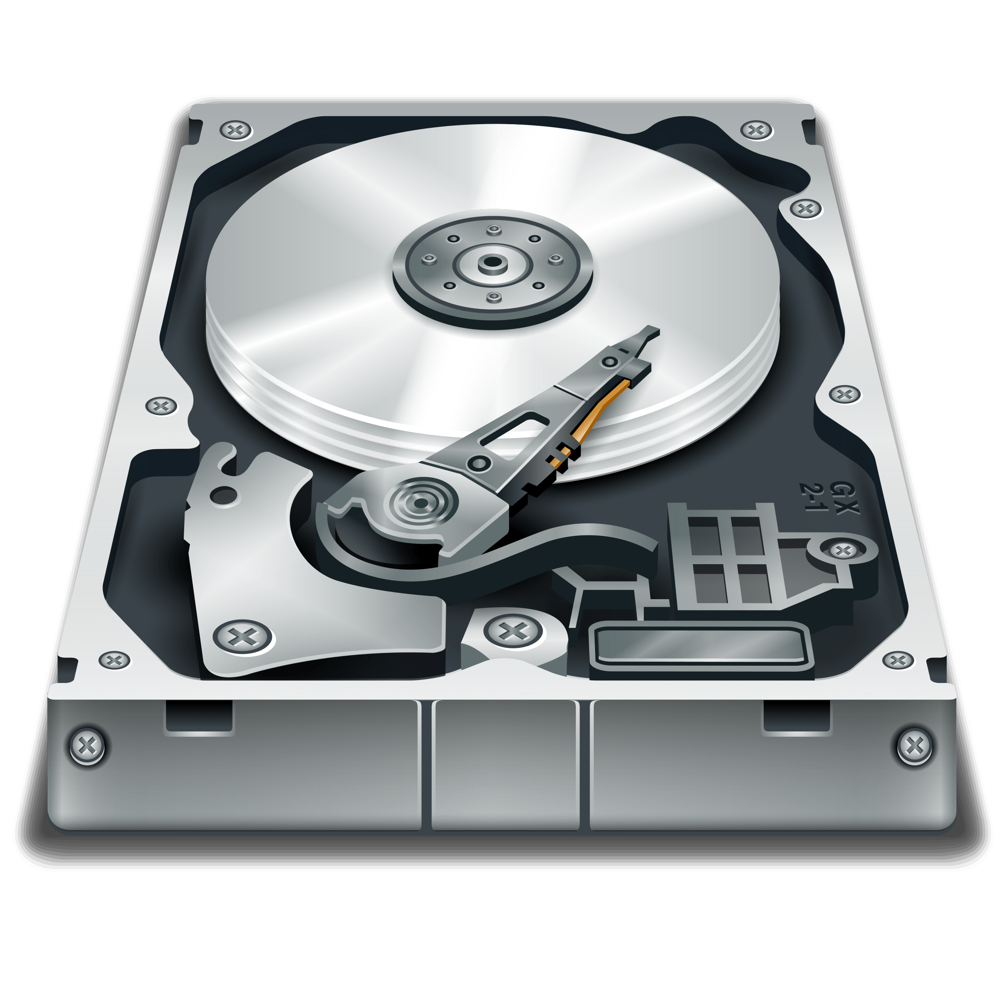</img>
<!-- image credit: https://www.stickpng.com/img/electronics/hard-drives/hard-drive-illustration -->

todos os ficheiros pode ser lidos *by default*

---

e quando
# ativamos encriptação

---

<!-- .slide: data-background-image="images/windows-key.gif" --><!-- image credit: selma design in https://theintercept.com/2015/12/28/recently-bought-a-windows-computer-microsoft-probably-has-your-encryption-key/ -->

#### a microsoft
#  fica com uma cópia

fonte: [theintercept.com](https://theintercept.com/2015/12/28/recently-bought-a-windows-computer-microsoft-probably-has-your-encryption-key/)

--- ---

# Navegação Anónima

Com a ajuda da rede **Tor**

---

# Porquê?
Para não revelar o que se está a investigar

---

# Rede Tor

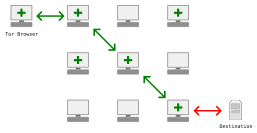

--- ---

<!-- SECURE DROP -->
<!-- .slide: data-background-image="images/securedrop-hexagons-background.png" -->

 

---

<!-- .slide: data-background-image="images/securedrop-news-orgs.png" -->

---

# Objetivo
Proteger fontes jornalísticas na era de vigilância de massas

---

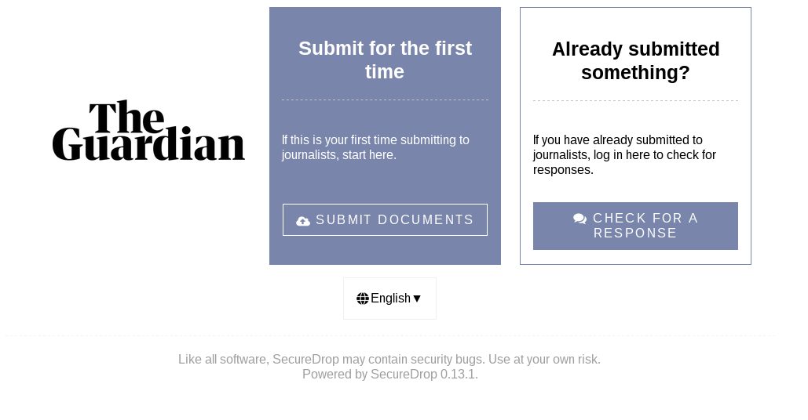

---

Outro objetivo é também garantir a
# segurança dos Jornalistas

note:
os ficheiros podem ser maliciosos

---

<!-- .slide: data-background-image="images/securedrop-hexagons-background.png" -->

Securedrop
# Workstation

<!-- announcement https://securedrop.org/news/road-towards-integrated-securedrop-workstation/ -->

---

<!-- .slide: data-background-image="images/securedrop-hexagons-background.png" -->

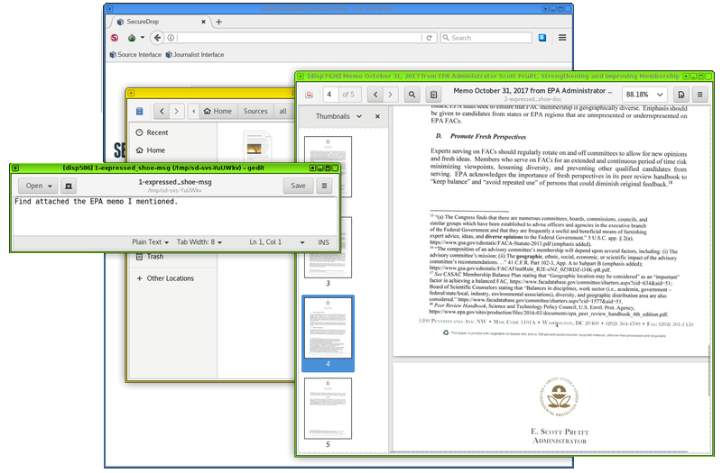

 Em desenvolvimento desde Julho 2017 

--- ---

# Notas Finais

---

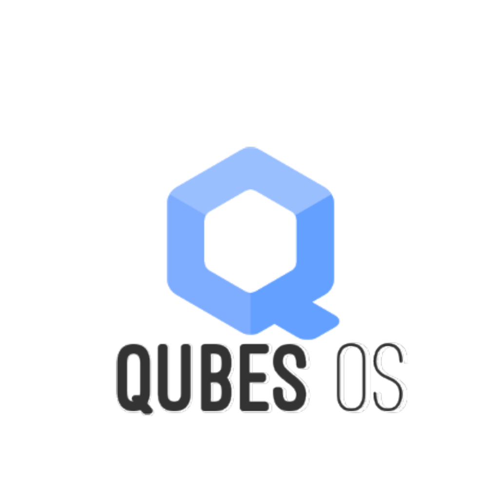
 <!-- .element: class="fragment" --> 

note:
Depois desta apresentação espero ter conseguido passar a imagem de que
o QubesOS consegue dar um grau de segurança incomparavelmente superior
mas...

---

<!-- .slide: data-background-image="images/opened-boxes-header.png" -->

nem tudo
#  são rosas
 

- requer formação <!-- .element: class="fragment" --> 
- segurança cria obstáculos à utilização <!-- .element: class="fragment" --> 
- requer computador moderno e potente <!-- .element: class="fragment" --> 
- bateria dura pouco  <!-- .element: class="fragment" --> 

---

É preciso
# medir os riscos
 

- proteção de fontes <!-- .element: class="fragment" --> 
- manipulação segura de ficheiros <!-- .element: class="fragment" --> 
- segurança do(a) jornalista <!-- .element: class="fragment" --> 

---

muito
# Obrigado

--- ---

# mais recursos

* [Qubes Website](https://qubes-os.org)

---
