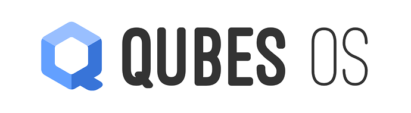
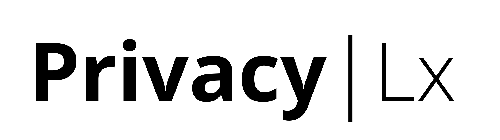
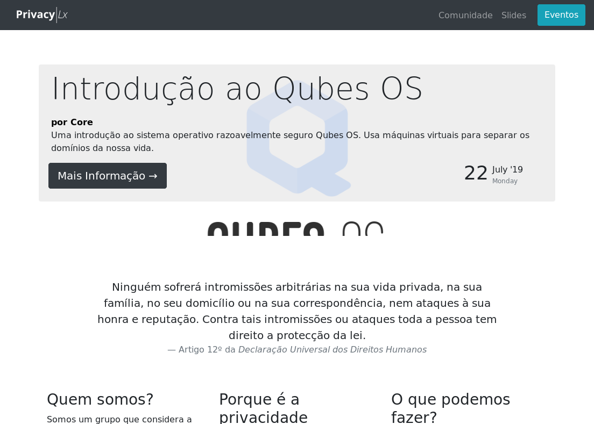
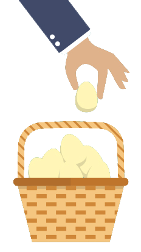
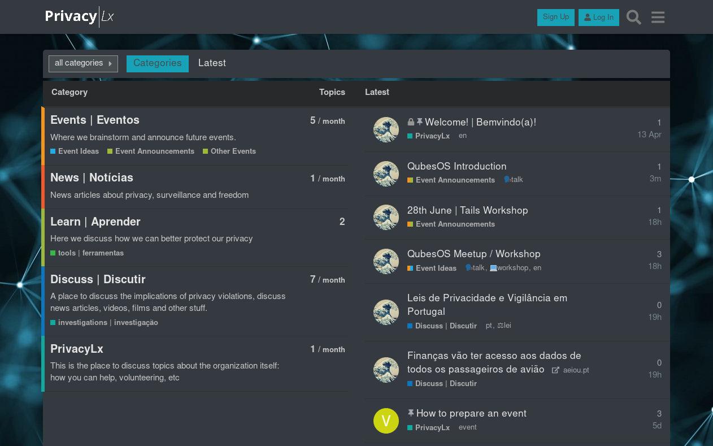
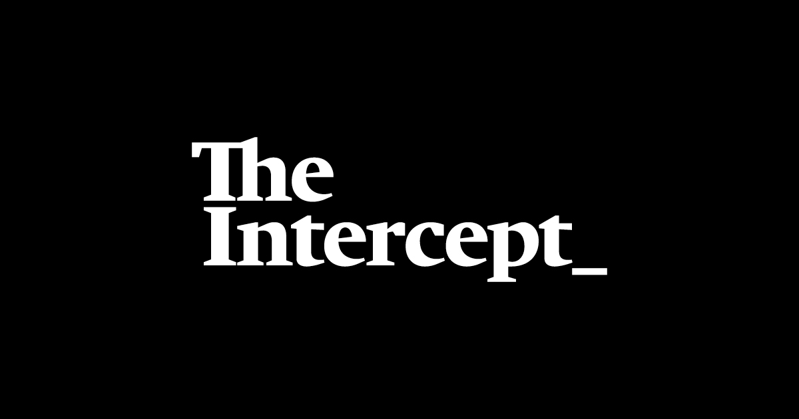
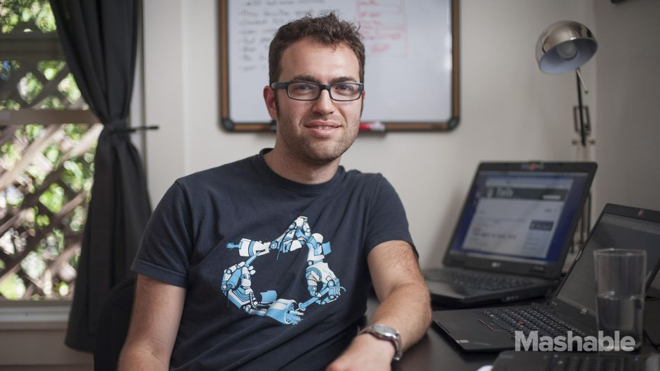

<!-- .slide: data-state="no-toc-progress" -->
<!-- don't show toc progress bar on this slide -->

a short introduction

note:
- thank the audience
- we'll present an operating system that can replace windows and has
  intersting security advantages

---

<!-- .slide: data-background-image="images/opened-boxes-header.png" -->

# Warning ⚠️

1. What we teach you here does not replace training by professionals

2. One can never be completely safe, only strive to improve security

note:
- the objective is just to make people aware of what QubesOS is
- more training is required if you wish to make the transition

---

# ✋ questions
Whenever you have one

--- ---

# Who we are?

---

A non-profit association based in Lisbon
<!-- .element: class="fragment" -->

  

Objective: *to help peole defend their **privacy** and **security** in the digital world.*
<!-- .element: class="fragment"-->

---

# privacylx.org

--- ---

# Context

note:

What is the current context of surveillance. With the ubiquity of
surveillance technologies there has to be a paradigm shift in terms of
journalistic security from the physical world of source protection
into the digital realm

---

# In the past

Journalists could protect their sources by simply not revealing who
they were when interrogated.

---

# No longer applies

Everything digital leaves a trace!

note:

examples include:
  - phone calls
  - deleted documents
  - emails
  - etc.

---

# Modern surveillance
  

</img>

- mass scale
- cheap
- ubiquitous

---

"Every journalist should understand that there is no such thing as
confidential digital communication.

**None of us have confidential sources.**"

 

--  [Alan Rusbridger, The Guardian editor](https://www.pressgazette.co.uk/rusbridger-how-no-journalists-sources-are-now-safe-joining-ipso-and-why-he-would-have-kept-news/)

---

### Can journalism without source protection
## be called journalism?

---

<!-- .slide: data-background-iframe="https://theintercept.com/2019/08/04/whistleblowers-surveillance-fbi-trump/" -->

Introductory article on the topic:
https://theintercept.com/2019/08/04/whistleblowers-surveillance-fbi-trump/

---

<!-- .slide: data-background-iframe="http://www.theguardian.com/uk-news/2015/jan/19/gchq-intercepted-emails-journalists-ny-times-bbc-guardian-le-monde-reuters-nbc-washington-post" -->

# GCHQ captured emails of journalists
[from top international media ](https://www.theguardian.com/uk-news/2015/jan/19/gchq-intercepted-emails-journalists-ny-times-bbc-guardian-le-monde-reuters-nbc-washington-post)

--- ---

# Computer
Security

note:

Security is hightly contextual. It always depends on what you are
investigating, who might be interested in that and othe
properties.

---

# OPSEC

Operational security

---

# Assets

What do we want to protect

--- ---

# The problem

---

</img>
</img>
  

Designed to be convenient
 <!-- .element: class="fragment" -->  
  
**but not for being secure**
 <!-- .element: class="fragment" --> 

---

</img>

#### We do everything in the same device

documents, emails, photos, etc.
<!-- .element: class="fragment" --> 

---

Some of the 
# Threats

---

# Phishing
Malicious emails

<!-- image source: https://www.googlewatchblog.de/2017/01/angriff-gmail-nutzer-neue/ -->

note:

Phishing is by far the most common attack. It consists on sending
malicious emails in the hopes that the target opens the
attachments. Independently of the ammount of training, it seems that a
minimum of 25% of the people on the organization end up on the trap if
the email is convincing enough.

---

# Unknown files

📄
👾

We get it: your job is in great part to open files<!-- .element: class="fragment" --> 

but if there are safer ways of doing that<!-- .element: class="fragment" --> 

---

# Surf on the web
🌐

note:

Certain websites, even from trusted source, can be infected with
malicious contents that may install malware on your computer even
without your action (esp. when you don't update your browser)

Add networks may also deliver malware

with that malicious parties may be able to search through your
folders, turn on your webcam, log you key strokes, etc.

---

# Physical theft

🔫

---

# Operating system

Windows, by default shares tons of stuff

</img>
👾

--- ---

</img>
# Qubes OS
as a solution

---

It's an alternative to
# Windows or MacOS
  

but may also run windows programs (more later on)

---

# Free Software

(as in freedom)

note:

Explain what it is and break the missconception that quality is
correlated with price. Highlight the importance of transparency of the
code for security auditability.

---

# Recommended
 

"If you're serious about security, Qubes OS is the best
OS available today. It's what I use, and free."

<cite>Edward Snowden </cite>

---

# Unique
in terms of security

---

Security through
### Compartimentalization

💻  <!-- .element: class="fragment" --> 
💻  <!-- .element: class="fragment" --> 
💻  <!-- .element: class="fragment" --> 

---

# Security domains

It all runs in virtual machines

note:

**DEMO:** open two AppVMs and show their file manager and prove that
they are indeed different computers. Highlight the fact that each has
their own border color and that no other machine can spoof that.

---

Organized by
# colors
🗃

📕 unsafe  &nbsp; 📘 work  &nbsp; 📙 safe

---

# 📕 unsafe

To browse untruested websites and do searches

---

# 📘 work

Where we keep our work documents, emails, etc.

---

# 📙 safe

Were we may keep passwords and other credentials in a password manager

---

# Choose your own

These are just some examples

 

You can decide on your own compartimentalization<!-- .element: class="fragment" --> 

---

# Demo

Let's see this in action

note:

show here various kinds of machines in parallel and again call out for
the colors. Show also the functionality of having a "safe" (offline)
VM

--- ---

# Isolation

Each virtual machine(qube) 

is isolated from the others

---

### 📁 Copying files

--- ---

# USB protection

We have control over what mahcine has access to what

---

# 📸 Webcam

Nothing has access to it

unless you explicitly tell it to

---

# 🎙 Microfone

idem.

--- ---

# Amnesiac
 

It's what allows us to become safe again
<!-- .element: class="fragment" --> 
even after we've been hacked
<!-- .element: class="fragment" --> 

notes:

all of the documents are may have been copied, though. But
compartimentalization helps mitigate that

---

# How ?

---

System only saves your documents (home folder)
<!-- .element: class="fragment" --> 

Uses a fresh copy of everything else once restarted
<!-- .element: class="fragment" --> 

---

# Instaling software

This may be a bit more tricky

Has to be done in a machine called **template**

---

# 🗑 Disposable Machines

notes:

explain what they are

---

📄 

# Read documents
### safely

---

📄 

# Edit documents
### safely

---

# Windows

We can also run window programs

notes:

but you'll find better alternatives to them soon enough

---

<!-- .slide: data-background-image="images/windows-qubes.png" -->

--- ---

# 🔐 Full Disk Encryption
  

If the computer is powered off, only with
you passphrase can the contents be read

---

by contrast
# on windows

</img>
<!-- image credit: https://www.stickpng.com/img/electronics/hard-drives/hard-drive-illustration -->

All files can be ready by anyone with access to your computer

---

And even when we
# activate full disk encryption

---

<!-- .slide: data-background-image="images/windows-key.gif" --><!-- image credit: selma design in https://theintercept.com/2015/12/28/recently-bought-a-windows-computer-microsoft-probably-has-your-encryption-key/ -->

#### Microsoft
#  keeps a copy

source: [theintercept.com](https://theintercept.com/2015/12/28/recently-bought-a-windows-computer-microsoft-probably-has-your-encryption-key/)

--- ---

# Anonymous browsing

With the help of **Tor**

---

# Why?

So you don't reveal what you are working on

notes:

  - can expose sources
  - protects you on a public wifi
  - can make another media take your story

---

# Tor Network

notes:

quick explanation of what it does

--- ---

<!-- SECURE DROP -->
<!-- .slide: data-background-image="images/securedrop-hexagons-background.png" -->

 

---

<!-- .slide: data-background-image="images/securedrop-news-orgs.png" -->

---

# Objective
Protect sources in the era of mass surveillance

---

---

Another objective is also the
# safety of journalists

note:

- for example the files sent to the by fake sources can be actually
  malicious actors

---

<!-- .slide: data-background-image="images/securedrop-hexagons-background.png" -->

Securedrop
# Workstation

<!-- announcement https://securedrop.org/news/road-towards-integrated-securedrop-workstation/ -->

---

<!-- .slide: data-background-image="images/securedrop-hexagons-background.png" -->

 Soon to come. In development since July 2017 

--- ---

# Final Notes

---

 <!-- .element: class="fragment" --> 

note:

After this presentation we hope to have passed you the message that
QubesOS can give you a higher security ground... but

---

<!-- .slide: data-background-image="images/opened-boxes-header.png" -->

not all
#  are roses
 

- requires some training <!-- .element: class="fragment" --> 
- relatively modern a beefy computer <!-- .element: class="fragment" --> 
- lower battery life  <!-- .element: class="fragment" --> 

---

One has to assess
# the risks
  

- source protection <!-- .element: class="fragment" --> 
- safely opening documents <!-- .element: class="fragment" --> 
- safetly of the jorunalist <!-- .element: class="fragment" --> 

---

# Thank you

---

# Community

</img>

cafe.privacylx.org

--- ---

# more resources

* [Qubes Website](https://qubes-os.org)

* [A Guide to Protecting Your Privacy for Journalists, Sources, and Everyone Else](https://github.com/freedomofpress/encryption-works/blob/master/encryption_works.md)

* [Investigating the Computer Security Practices
and Needs of Journalists](https://www.usenix.org/system/files/conference/usenixsecurity15/sec15-paper-mcgregor.pdf)

---

--- ---

--- ---

# Unused Slides

---

# 📋 Clipboard

copy `ctrl-c`

shared clipboard copy: `ctrl-shift-c`
<!-- .element: class="fragment" --> 

shared clipboard past: `ctrl-shift-v`
<!-- .element: class="fragment" --> 

paste `ctrl-v`

---

- **Journalistic sources**
<!-- .element: class="fragment" -->
- documents of current investigations
<!-- .element: class="fragment" -->
- and past ones
<!-- .element: class="fragment" -->

  

- sensitive communications
<!-- .element: class="fragment" -->
- online accounts
<!-- .element: class="fragment" -->

--- ---

#### State-of-the-art 
# journalist security

---

#### Study case
# The Intercept

---

* [Meet the Man Hired to Make Sure the Snowden Docs Aren't Hacked](https://mashable.com/2014/05/27/micah-lee-greenwald-snowden/?europe=true)

---

> Lee’s position is rare in the media world. But in the age of secret-spilling and the government clampdown on reporters' sources, news organizations are aiming to strengthen their digital savvy with hires like him.
